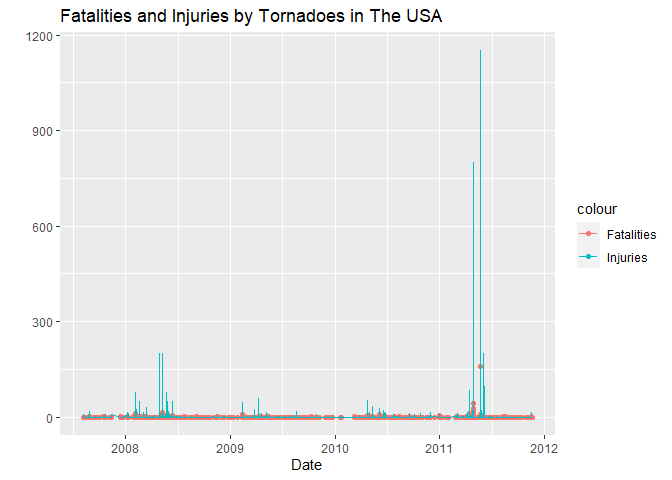

## Abstract


## Loading and Processing The Data

We start our analysis by downloading  and reading the [storm data](https://d396qusza40orc.cloudfront.net/repdata%2Fdata%2FStormData.csv.bz2). Then we check the number of variables and observations.


```r
download.file("https://d396qusza40orc.cloudfront.net/repdata%2Fdata%2FStormData.csv.bz2","data.bz2")
df<-read.csv("data.bz2")
dim(df)
```

```
## [1] 902297     37
```

We see that the dataset is very large, having 37 variables and 902297 observations. Since the focus of our analysis are the population health and economic impacts, we can remove many of the variables, improving the performance of the code. Then, we can check the type and format of the data.


```r
df<-subset(df, select = c("BGN_DATE", "STATE","EVTYPE","FATALITIES","INJURIES","PROPDMG","PROPDMGEXP","CROPDMG","CROPDMGEXP"))
str(df)
```

```
## 'data.frame':	902297 obs. of  9 variables:
##  $ BGN_DATE  : chr  "4/18/1950 0:00:00" "4/18/1950 0:00:00" "2/20/1951 0:00:00" "6/8/1951 0:00:00" ...
##  $ STATE     : chr  "AL" "AL" "AL" "AL" ...
##  $ EVTYPE    : chr  "TORNADO" "TORNADO" "TORNADO" "TORNADO" ...
##  $ FATALITIES: num  0 0 0 0 0 0 0 0 1 0 ...
##  $ INJURIES  : num  15 0 2 2 2 6 1 0 14 0 ...
##  $ PROPDMG   : num  25 2.5 25 2.5 2.5 2.5 2.5 2.5 25 25 ...
##  $ PROPDMGEXP: chr  "K" "K" "K" "K" ...
##  $ CROPDMG   : num  0 0 0 0 0 0 0 0 0 0 ...
##  $ CROPDMGEXP: chr  "" "" "" "" ...
```

We are left with 9 variables now. The first  being  the BGN_DATE, which corresponds to the event date. It is useful to change the variable date type. To do so, we are going to use the lubridate and stringr packages.


```r
library(lubridate)
library(stringr)
df$BGN_DATE<- mdy(str_split(df$BGN_DATE," ", simplify = TRUE) [,1])
```

Now we are going to take a deeper look into the variables.


```r
summary(df)
```

```
##     BGN_DATE             STATE              EVTYPE            FATALITIES      
##  Min.   :1950-01-03   Length:902297      Length:902297      Min.   :  0.0000  
##  1st Qu.:1995-04-20   Class :character   Class :character   1st Qu.:  0.0000  
##  Median :2002-03-18   Mode  :character   Mode  :character   Median :  0.0000  
##  Mean   :1998-12-27                                         Mean   :  0.0168  
##  3rd Qu.:2007-07-28                                         3rd Qu.:  0.0000  
##  Max.   :2011-11-30                                         Max.   :583.0000  
##     INJURIES            PROPDMG         PROPDMGEXP           CROPDMG       
##  Min.   :   0.0000   Min.   :   0.00   Length:902297      Min.   :  0.000  
##  1st Qu.:   0.0000   1st Qu.:   0.00   Class :character   1st Qu.:  0.000  
##  Median :   0.0000   Median :   0.00   Mode  :character   Median :  0.000  
##  Mean   :   0.1557   Mean   :  12.06                      Mean   :  1.527  
##  3rd Qu.:   0.0000   3rd Qu.:   0.50                      3rd Qu.:  0.000  
##  Max.   :1700.0000   Max.   :5000.00                      Max.   :990.000  
##   CROPDMGEXP       
##  Length:902297     
##  Class :character  
##  Mode  :character  
##                    
##                    
## 
```

The events dates range from 1950 to 2011, a 61 years interval, but 50% of the data was recorded after 1998 and 25% was recorded after 2007. Being so, we are going to focus our analysis in the latter period, since our social/economic/technology context is more related to this period and doing that, we also improve the code performance and time consuming. Another thing we can do to improve the performance is to keep track only of the events that have had some kind of impact in the population health or economy. We can see in the summary above that most of the events have not caused any deaths (FATALITIES variable), injuries (INJURY variable), property damage (PROPDMG variable) or crop damage (CROPDMG).


```r
df<-subset(df, BGN_DATE >= ymd("2007-07-28") & (FATALITIES > 0 | INJURIES > 0 | PROPDMG > 0 | CROPDMG >0))
dim(df)
```

```
## [1] 72869     9
```

Now we are left with 72869 observations.


## Cleaning The Data

In the summary above is shown that the crop and property damage are broken in two columns for each, respectively, CROPDM, CROPDMEXP, PROPDM and PROPDMEXP. That breaks one of the tidy data principles and must be corrected. First, we are going to check the PROPDMGEXP and CROPDMGEXP. 

```r
table(df$PROPDMGEXP)
```

```
## 
##     B     K     M 
##     9 70301  2559
```

```r
table(df$CROPDMGEXP)
```

```
## 
##     K     M 
## 72327   542
```

We here assume that K, M and B represent respectively 10<sup>3</sup>, 10<sup>6</sup> and 10<sup>9</sup> factors. Let's put it all together in a single column for each variable.


```r
df$CROPAUX <- ifelse(df$CROPDMGEXP=="K",3,ifelse(df$CROPDMGEXP=="M",6,9))
df$PROPAUX <- ifelse(df$PROPDMGEXP=="K",3,ifelse(df$PROPDMGEXP=="M",6,9))
df$CROPDMG <- df$CROPDMG * 10 ^ df$CROPAUX
df$PROPDMG <- df$PROPDMG * 10 ^ df$PROPAUX
df <- df<-subset(df, select = c("BGN_DATE", "STATE","EVTYPE","FATALITIES","INJURIES","PROPDMG","CROPDMG"))
```

Since we are going to analyze the economic impact, it is interesting to add the property and crop damage together.


```r
df$TOTALDMG <- df$PROPDMG + df$CROPDMG
```

Now we are going to take a look in the event type variable, which is corresponded by the EVTYPE column. The event types must be as described in the [storm data documentation](https://d396qusza40orc.cloudfront.net/repdata%2Fpeer2_doc%2Fpd01016005curr.pdf)


```r
table(df$EVTYPE)
```

```
## 
##    ASTRONOMICAL LOW TIDE                AVALANCHE                 BLIZZARD 
##                        2                       91                       95 
##            COASTAL FLOOD          COLD/WIND CHILL                DENSE FOG 
##                       91                       80                       30 
##              DENSE SMOKE                  DROUGHT               DUST DEVIL 
##                        1                       86                       33 
##               DUST STORM           EXCESSIVE HEAT  EXTREME COLD/WIND CHILL 
##                       30                      107                       33 
##              FLASH FLOOD                    FLOOD             FREEZING FOG 
##                     7036                     4922                        7 
##             FROST/FREEZE             FUNNEL CLOUD                     HAIL 
##                       70                        4                     5907 
##                     HEAT               HEAVY RAIN               HEAVY SNOW 
##                      119                      366                      213 
##                HIGH SURF                HIGH WIND                HURRICANE 
##                       79                     2150                       28 
##                ICE STORM         LAKE-EFFECT SNOW          LAKESHORE FLOOD 
##                      190                      129                        2 
##                LANDSLIDE                LIGHTNING              MARINE HAIL 
##                       93                     3392                        2 
##         MARINE HIGH WIND       MARINE STRONG WIND MARINE THUNDERSTORM WIND 
##                        7                       35                       28 
##              RIP CURRENT                   SEICHE         STORM SURGE/TIDE 
##                      185                        3                       38 
##              STRONG WIND        THUNDERSTORM WIND                  TORNADO 
##                     2166                    39092                     4315 
##      TROPICAL DEPRESSION           TROPICAL STORM                  TSUNAMI 
##                        7                      226                       12 
##               WATERSPOUT                 WILDFIRE             WINTER STORM 
##                       10                      561                      472 
##           WINTER WEATHER 
##                      324
```

All of the events agree with the documentation list with the exception of the *LANDSLIDE* type. That difference is also explained in  the documentation and the description should be replaced by the *DEBRIS FLOW*.


```r
df$EVTYPE[df$EVTYPE=="LANDSLIDE"] <- "DEBRIS FLOW"
```


## Results


### Population Health Impact

We start by looking for the events that were responsible for the largest numbers of fatalities and injuries.


```r
sort(tapply(df$FATALITIES,df$EVTYPE, sum, simplify = TRUE),decreasing = TRUE)[1:10]
```

```
##           TORNADO       FLASH FLOOD              HEAT       RIP CURRENT 
##               789               251               171               168 
##             FLOOD         LIGHTNING THUNDERSTORM WIND    EXCESSIVE HEAT 
##               148               132               121               113 
##   COLD/WIND CHILL         AVALANCHE 
##                90                72
```

```r
sort(tapply(df$INJURIES,df$EVTYPE, sum, simplify = TRUE),decreasing = TRUE)[1:10]
```

```
##           TORNADO THUNDERSTORM WIND    EXCESSIVE HEAT         LIGHTNING 
##              9029              1301               879               827 
##              HEAT          WILDFIRE    WINTER WEATHER       FLASH FLOOD 
##               700               410               324               302 
##             FLOOD              HAIL 
##               167               156
```


```r
tornadoes <- subset(df, EVTYPE == "TORNADO", select=c("BGN_DATE","FATALITIES", "INJURIES"))
tornadoes_injuries_proportion <- sum(tornadoes$INJURIES)/sum(df$INJURIES)
tornadoes_fatalities_proportion <- sum(tornadoes$FATALITIES)/sum(df$FATALITIES)
print(tornadoes_injuries_proportion)
```

```
## [1] 0.6024555
```

```r
print(tornadoes_fatalities_proportion)
```

```
## [1] 0.3310953
```

Tornadoes are, by far, the most harmful events to the population health, being responsible for more than 30% of the deaths and 60% of the injuries in a universe of more than 40 types of weather events.


```r
library(ggplot2)
library(gridExtra)
ggplot(data=tornadoes, aes(x=BGN_DATE)) + geom_point(aes(y=FATALITIES, colour="Fatalities")) + geom_line(aes(y=INJURIES, colour="Injuries")) + labs(x="Date", y="", title="Fatalities and Injuries by Tornadoes in The USA")
```

<!-- -->

As expected, the number of fatalities grows with the number of injuries. We have a very high peak of deaths and injuries in the year of 2011, more precisely on april, when occurred the [Super Outbreak](https://en.wikipedia.org/wiki/2011_Super_Outbreak), which is considered the largest tornado outbreak ever recorded.

The Super Outbreak is clearly a rare event. In order to verify how the tornadoes affect the population health in regular basis, let's take a look on the data without the observations that occurred in 2011.


```r
dfWithout2011 <- subset(df, year(BGN_DATE)!=2011)
sort(tapply(dfWithout2011$FATALITIES,dfWithout2011$EVTYPE, sum, simplify = TRUE),decreasing = TRUE)[1:10]
```

```
##           TORNADO       FLASH FLOOD       RIP CURRENT              HEAT 
##               202               183               139               108 
##         LIGHTNING             FLOOD    EXCESSIVE HEAT   COLD/WIND CHILL 
##               106                90                77                69 
## THUNDERSTORM WIND         AVALANCHE 
##                67                63
```

```r
sort(tapply(dfWithout2011$INJURIES,dfWithout2011$EVTYPE, sum, simplify = TRUE),decreasing = TRUE)[1:10]
```

```
##           TORNADO THUNDERSTORM WIND    EXCESSIVE HEAT         LIGHTNING 
##              2866               928               741               633 
##    WINTER WEATHER          WILDFIRE       FLASH FLOOD             FLOOD 
##               324               294               272               157 
##           TSUNAMI              HAIL 
##               129               125
```

```r
tornadoesWithout2011 <- subset(tornadoes, year(BGN_DATE)!=2011)
tornadoes_injuries_proportion_w11 <- sum(tornadoesWithout2011$INJURIES)/sum(dfWithout2011$INJURIES)
tornadoes_fatalities_proportion_w11 <- sum(tornadoesWithout2011$FATALITIES)/sum(dfWithout2011$FATALITIES)
print(tornadoes_injuries_proportion_w11)
```

```
## [1] 0.3983322
```

```r
print(tornadoes_fatalities_proportion_w11)
```

```
## [1] 0.1462708
```

Tornadoes are still number one in both fatalities and injuries, being responsible for almost 15% of the deaths and almost 40% of the injuries.

### Economic Impact

Similarly to the population health impact analysis, we start by looking for the events that were responsible for the largest numbers of crop and property damage.


```r
sort(tapply(df$CROPDMG,df$EVTYPE, sum, simplify = TRUE),decreasing = TRUE)[1:10]
```

```
##             FLOOD              HAIL       FLASH FLOOD      FROST/FREEZE 
##        2372542000         763870000         706002000         552772000 
##           DROUGHT THUNDERSTORM WIND    TROPICAL STORM         HURRICANE 
##         421939000         231958000         180921000         180510000 
##           TORNADO         HIGH WIND 
##         100237000          91522000
```

```r
sort(tapply(df$PROPDMG,df$EVTYPE, sum, simplify = TRUE),decreasing = TRUE)[1:10]
```

```
##             FLOOD           TORNADO              HAIL  STORM SURGE/TIDE 
##       13643163800       13427223690        5782341200        4640643000 
##       FLASH FLOOD THUNDERSTORM WIND         HURRICANE          WILDFIRE 
##        4452702830        3262658790        2467600000        1594593470 
##         HIGH WIND      WINTER STORM 
##        1180707540         886270000
```
